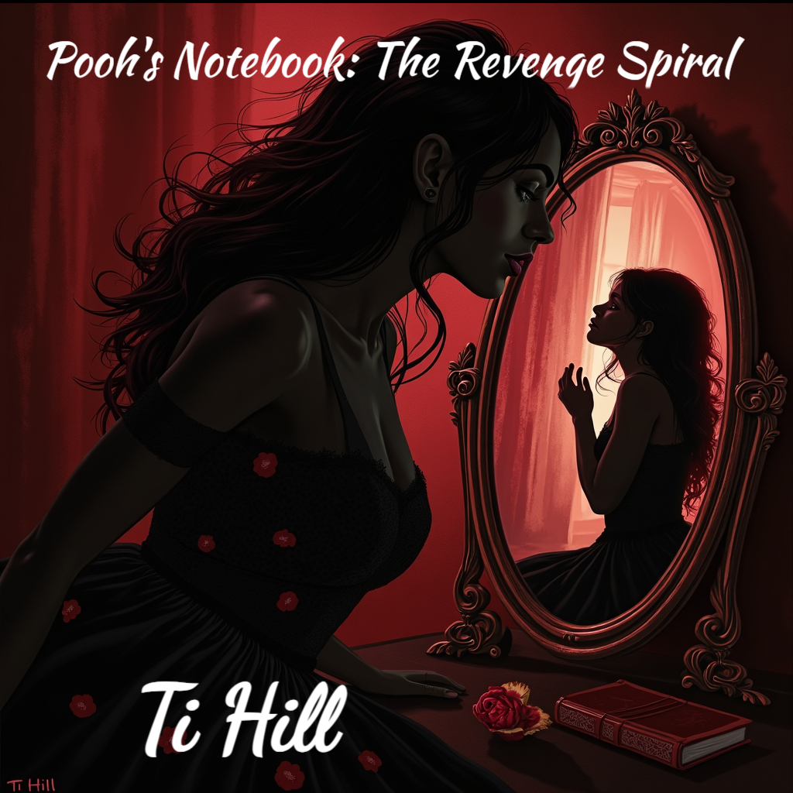

<!DOCTYPE html>
<html lang="en">
<head>
  <meta charset="UTF-8">
  <meta name="viewport" content="width=device-width, initial-scale=1.0">
  <title>Pooh’s Notebook: The Revenge Spiral</title>
  
</head>
<body>
  <nav>
    <a href="#dedication">Dedication</a>
    <a href="#acknowledgements">Acknowledgements</a>
    <a href="#chapter">Chapter 42</a>
    <a href="#excerpt">Excerpt</a>
    <a href="#shop">Shop</a>
    <a href="#newsletter">Newsletter</a>
    <a href="#about">About</a>
  </nav>
  

    <section id="dedication">
      <h2>Dedication</h2>
      
To the quietly unhinged, the beautifully broken, and the ones who laugh at the darkest parts of their stories.
      May you always dance with your demons, and make them wear heels.

      
To the girls who never got the apology. 
      To the women who turned their pain into power. 
      To the ones who said, “You’re crazy,” and meant it like a compliment. 
      This is for you.

      
To my wife, Keri—thank you for patiently waiting for me to finish writing this book. I know it started off as a way to escape and vent, but you let me creatively flow, spiral, and stitch this world back together without judgment. I love you more than words can carry.

    </section>

    <section id="acknowledgements">
      <h2>Acknowledgements</h2>
      
To my late-night thoughts and my early-morning doubts—you both kept me grounded. 
      To my friends who answered “Is this too much?” with “Not enough”—thank you. 
      To every reader who rooted for Pooh, even when she crossed the line and danced on the other side of morality—you saw her the way I did.

      
To my editors, my coffee, and my sanity—none of which survived this process in one piece.

      
And to the versions of myself that I had to outgrow just to write this: thank you for the fire. The scars make better ink.

    </section>

    <section id="chapter">
      <h2>Chapter 42: The Meeting Room</h2>
      
The Committee sat in their usual chairs.

      
Long table. Dim light... [rest of existing content continues unchanged]

    </section>

    <section id="excerpt">
      <h2>Excerpt</h2>
      <blockquote><em>“Real love is about trust in chaos. It’s being handed a lit match and still choosing to stand in the gasoline.”</em> —Pooh 🖤</blockquote>
    </section>

    <section id="shop">
      <h2>Shop</h2>
      
Coming Soon: Pre-order signed copies of <em>Pooh’s Notebook</em>, exclusive merch, and more.

    </section>

    <section id="newsletter">
      <h2>Newsletter Signup</h2>
      
Want behind-the-scenes notes from Pooh’s next spiral? Be the first to read excerpts from Volume II: <em>Love’s Labyrinth</em>, get updates on film/TV deals, and never miss a wicked word.

      
<a href="#">Subscribe to Newsletter →</a>

    </section>

    <section>
      <h2>Cover Art</h2>
      
    </section>

    <section id="about">
      <h2>About the Author</h2>
      
Ti Hill is a storyteller who loves twisted characters, psychological warfare, and messy heroines with big hearts and even bigger vendettas. Based in the South, she balances motherhood and creativity with equal parts chaos and clarity. <em>Pooh’s Notebook: The Revenge Spiral</em> is her debut novella—a fever-dream revenge tale that blurs the line between love and lunacy.

    </section>
  

</body>
</html>
